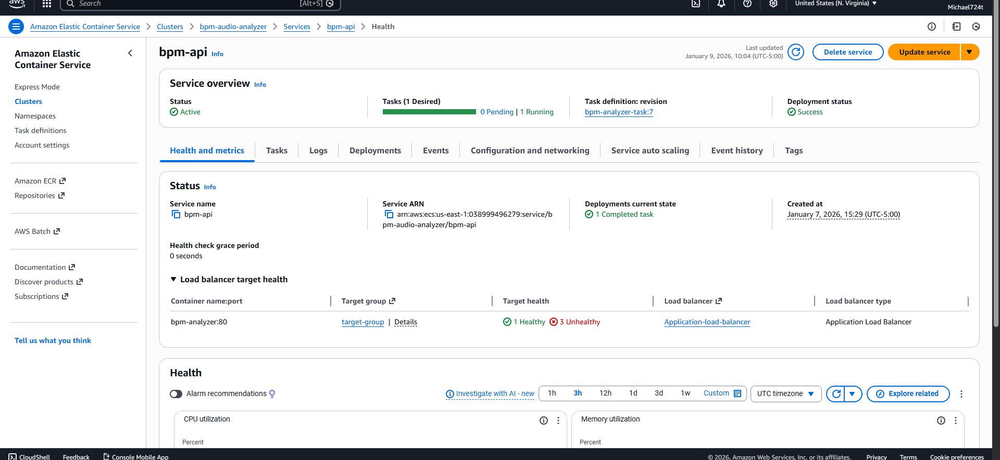
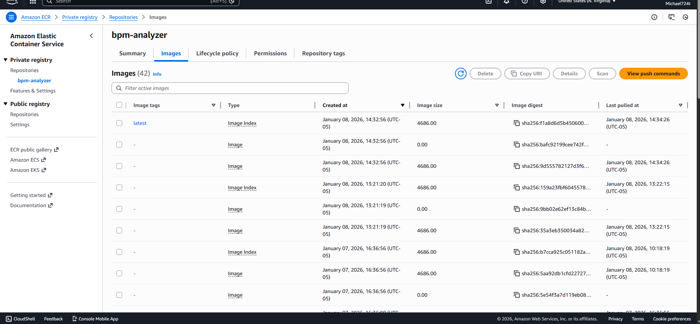
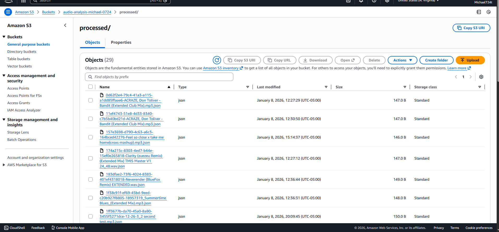

# BPM-Analyzer

A web-based tool that analyzes uploaded audio files, extracts tempo (BPM), RMS, ZCR,  and spectral centroid and then returns results.


## Key Technologies

- Docker containerized application
- AWS Fargate (ECS) for running container 
- FastAPI backend 
- AWS S3 for storing uploaded files
- Elastic Load Balancer for web traffic routing


## features 

- Upload .wav, .mp3, or .flac files
- Extract BPM using librosa + DeepRhythm
- Return BPM, RMS, ZCR, and Spectral Centroid
- Deployed using real production infrastructure
## Architecture overview

User -> LoadBalancer -> ECS_Task -> FastAPI Container -> S3 bucket

1. ECS launches docker container which is running fastAPI among all other dependencies in requirments.txt
2. Load balancer will forward HTTP requests to container 
3. All uploaded files go to S3 
4. API will process audio and return BPM 
## For Running Locally 

Install dependencies withing requirement.txt and requirement-extra.txt 

```bash
  uvicorn app.main:app --reload
```

## Demo 

- Fully working locally
- AWS cluster is currently paused for cost control. See deployment information below or reach out to mikey724t@hotmail.com if you would like me to turn everything back on for a demo.

    
## Deployment

Proof of deployment to AWS 
### ECS Cluster - Live API Deployment 

ECS Fargate service successfully deploying the BPM Analyzer API behind an
Application Load Balancer. The container runs inside a Fargate task using
awsvpc networking, exposing port 8000 to the load balancer listener on port 80.
The service automatically registers tasks with the target group, performs
health checks, and replaces failing tasks to ensure continuous availability.
 
### ECR Container Registry

ECR storing docker images containerized into AWS. Each time the application is rebuilt, the container is
tagged and pushed to ECR, where ECS pulls the latest revision to run inside
Fargate. This allows for consistent repoducible runtime enviroments. 

### S3 File Storage

S3 bucket results showing all the processed audio files that people have uploaded to the analyzer. Demonstrates cloud-native storage integration between my API and AWS services


## Future integration

Mass upload music files to S3 for large scale analysis of files using AI agents


## Authors

- [@Michael Tumminia](https://github.com/Michael24t)

